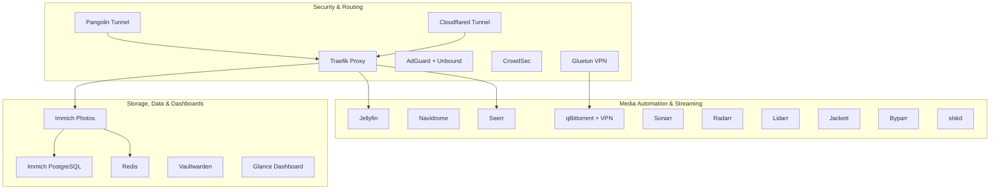
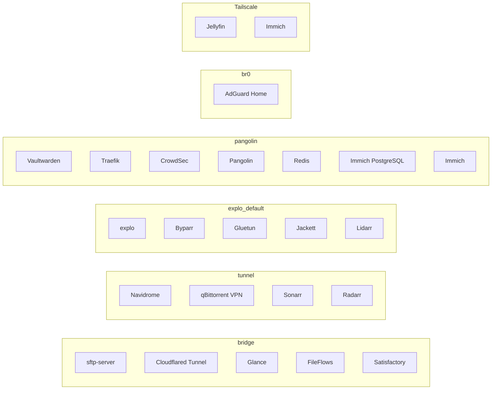
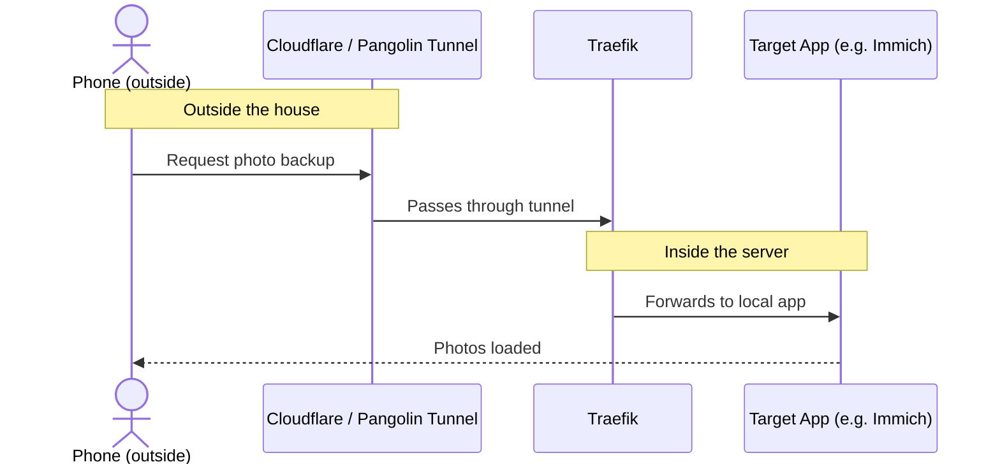

# Nargothrond

Named after the legendary hidden fortress of the First Age from *The Silmarillion*, Nargothrond is the quiet powerhouse of my home network. It secures my devices, backs up my photos, and serves up movie nights and music streaming — all from a single box tucked away in a closet.

Think of this document as the master blueprint for my favorite home server.

## Table of Contents

1. [Hardware](#hardware)
2. [Software Stack](#software-stack)
3. [Network Segmentation](#network-segmentation)
4. [Traffic Flow](#traffic-flow)
5. [Plugins](#plugins)
6. [On-Demand Sleepers](#on-demand-sleepers)

---

## Hardware

Nargothrond runs on modern, power-efficient hardware that keeps things snappy without blowing up the electric bill.

 Component | What's Inside | Why It Matters |
| --- | --- | --- |
| **Operating System** | UNRAID Server v7.3.1 | Foundation for managing the docker stack and mixed drive array. |
| **Case** | Jonsbo N6 | A compact NAS-style enclosure with room for a full HDD array in a small footprint. |
| **Motherboard** | ASUS Prime Z890M-Plus (LGA 1851, Micro-ATX) | Provides the platform for Arrow Lake, plus enough PCIe lanes for the 10GbE NIC and NVMe pool. |
| **CPU** | Intel Core Ultra 5 225 | Arrow Lake architecture delivers strong power efficiency, and the built-in iGPU handles media transcoding. |
| **CPU Cooler** | Noctua NH-U12A | A quiet, high-airflow tower cooler that keeps thermals in check under transcoding loads. |
| **Case Fans** | 2x Noctua NF-A12x25 (120mm) | Low-noise airflow tuned for a mixed CPU and HDD-cooling setup. |
| **Power Supply** | Seasonic Focus SGX-750 (750W, SFX) | An 80+ Gold efficient SFX unit sized for the CPU, HDD array, and NVMe pool combined. |
| **RAM** | 2x ADATA 24GB DDR5 5600MHz (48GB total) | Headroom for databases, caches, and concurrent user sessions. |
| **Array Storage** | 1x WD Gold 14TB + 2x WD 12TB (used) in a parity array | The main vault — a failed drive doesn't mean lost data. |
| **Cache Storage** | 2TB NVMe pool + 1TB NVME boot drive | Absorbs raw file writes and keeps app configurations flying. |
| **Network** | Realtek RTL8127 10GbE NIC + 1Gbps LAN, split into VLANs | High-speed backbone for large file transfers, segmented so smart home devices stay away from sensitive data. |
---

## Software Stack

The application ecosystem is organized into functional groups, mirroring how UNRAID's Docker tab lays them out.

### Network Gatekeepers & Security

* **Traefik**  — the traffic cop of the stack. Routes incoming requests to the correct container and manages SSL certificates automatically.
* **AdGuard Home + Unbound**  — network-wide DNS filtering. Blocks ads and trackers for every device on the LAN while keeping DNS queries private.
* **CrowdSec**  — a collaborative intrusion-detection system. Watches server logs for malicious behavior and bans offenders in real time.
* **Gluetun**  — a VPN gateway container. Routes specific applications (like the download client) through an encrypted tunnel so they never touch the network directly.
* **Pangolin**  — a self-hosted, identity-aware tunneled reverse proxy built on WireGuard. It works alongside Traefik to publish services to the outside world without opening inbound ports, and adds access control on top.

### Remote Access & Secrets

* **Unraid Cloudflared Tunnel**  — an outbound tunnel to Cloudflare, used for exposing select services without opening router ports.
* **Vaultwarden**  — a self-hosted password vault, syncing credentials across phones and computers.

### Media Automation (The *Arr Stack)

* **Jellyfin**  — the media server. Organizes the movie and TV library and streams to any screen in the house.
* **Navidrome**  — a self-hosted Spotify-style client for a lossless personal music library.
* **Seerr**  — a request dashboard where family and friends can ask for new movies or shows, which then flow automatically into the download pipeline.
* **Sonarr / Radarr**  — automated scouts that monitor for new TV episodes and movies, then fetch and sort them.
* **Lidarr**  — the same idea, tuned for music releases and favorite artists.
* **qBittorrent (binhex, VPN-locked)**  — the download engine, hardwired to run only through Gluetun's kill-switch so downloads stay private.
* **Jackett & Byparr**  — indexer proxies that help Sonarr, Radarr, and Lidarr search across trackers for the best-quality releases.
* **slskd**  — a web client for the Soulseek network, useful for rare or indie music finds.

### Storage, Data & Dashboards

* **Immich**  — a self-hosted alternative to Google Photos, backing up phone photos and organizing them locally.
* **Immich PostgreSQL & Redis**  — the database and cache layer that keep Immich fast when browsing large photo libraries.
* **Glance**  — a clean landing-page dashboard showing the time, weather, system status, and favorite links.

---

## Network Segmentation

UNRAID's Docker network assignments double as a security boundary. Each container only talks to what it needs to.

* **bridge** — general-purpose, low-sensitivity containers with no need for isolation.
* **tunnel** — services that route through the Cloudflare or VPN egress path.
* **explo_default** — the indexer and VPN-adjacent tooling that supports the *arr stack.
* **pangolin** — the security-critical core: reverse proxy, intrusion detection, secrets, and the photo library database, all kept on a dedicated network.
* **br0** — macvlan bridge, giving AdGuard Home its own LAN-visible IP so it can serve DNS to every device.
* **Tailscale** — an overlay mesh network for Jellyfin and Immich, allowing secure remote access without a public tunnel.

---

## Traffic Flow

To keep Nargothrond secure, inbound traffic from the outside world is handled differently than traffic from inside the house.

1. **From the outside** — requests pass through the Cloudflare or Pangolin tunnel into Traefik. Traefik inspects the hostname and routes it to the correct container, with no inbound ports opened on the router.
2. **From the couch** — local devices query AdGuard Home first, which strips trackers and ad domains, then hit Traefik directly over the LAN without touching the public internet.
3. **VLAN isolation** — if a smart bulb or IoT device is compromised, it cannot reach the containers holding photos or passwords, because VLANs keep those devices on a separate network island.

---

## Plugins

Beyond the Docker containers, a set of UNRAID plugins keeps the server itself healthy, tuned, and easy to manage.

| Category | Plugin | Purpose |
| --- | --- | --- |
| Management | Community Applications | The app-store front end for installing new Docker containers. |
| Management | Compose Manager Plus | Adds Docker Compose support and a management UI. |
| Management | User Scripts / User Scripts Enhanced | Run and schedule custom scripts from the web UI. |
| Backup | Appdata Backup | Backs up Docker container configs and app data. |
| Backup | Appdata Cleanup Plus | Finds orphaned app-data folders left behind by removed containers. |
| Storage | Unassigned Devices / Plus / Preclear | Mounts drives outside the main array and preps new disks before adding them. |
| Storage | Disk Location | Maps drives to their physical bay for easy identification. |
| Storage | Parity Check Tuning | Runs parity checks and rebuilds in scheduled increments instead of all at once. |
| Storage | Dynamix Cache Directories | Keeps folder metadata in memory to reduce unnecessary disk spin-up. |
| Monitoring | Dynamix System Info / Statistics / Temperature | Real-time hardware, performance, and thermal monitoring. |
| Monitoring | GPU Statistics / Intel GPU TOP | Dashboard stats and CLI tooling for the iGPU used in transcoding. |
| Monitoring | Dynamix Active Streams | Shows live SMB, AFS, and Plex streams in use. |
| Monitoring | File Activity v2 | Tracks recent read/write activity per disk. |
| Maintenance | Fix Common Problems | Scans for and flags common configuration issues. |
| Maintenance | CA Auto Update Applications | Keeps installed apps and plugins current automatically. |
| Tuning | AutoTweak / Tips and Tweaks | Power profile and network stack tuning for performance or efficiency. |
| Tuning | ASPM Helper | Enables proper power-management states on supported devices. |
| Networking | RTL8125 / RTL8126 Drivers | Out-of-tree Realtek NIC drivers for hardware not natively supported. |
| Appearance | Dynamix System Buttons | One-click sleep, reboot, and shutdown buttons in the header. |
| Appearance | Custom WebUI CSS | Custom styling and theming for the UNRAID web interface. |

---

## On-Demand Sleepers

These containers are fully configured but kept stopped until needed for a specific project or game night.

* **satisfactory-server** — a dedicated game server, spun up for factory-building sessions.
* **FileFlows** — automated re-encoding and file-size optimization for the media library.
* **sftp-server** — a secure portal for manually moving large files onto the array.

---

*Long live the hidden fortress Nargothrond.*
